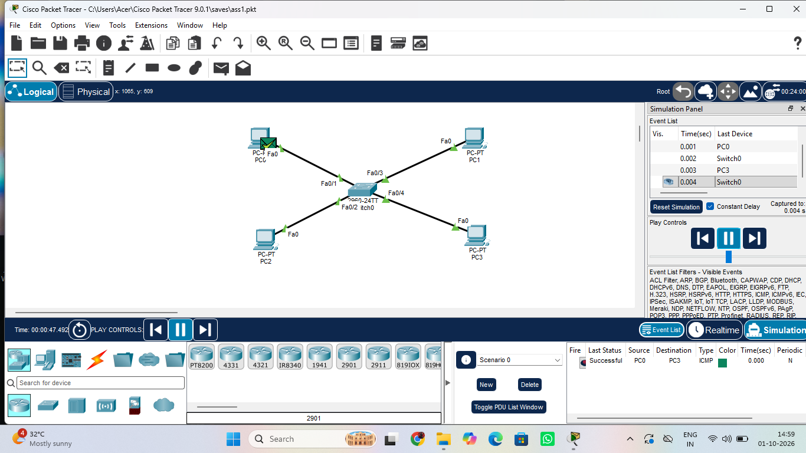

# Assignment 1 - Basic LAN Setup

## Objective
To create a basic Local Area Network (LAN) using one switch and four PCs and verify communication between the devices.
## Network Topology and Verification

## Devices Used
- 1 Switch
- 4 PCs

## Network Topology
Star Topology

## Configuration
- Connected all PCs to the switch using copper straight-through cables.
- Assigned IP addresses to all PCs.
- Verified network connectivity using the ping command.

## Verification
- Successful communication between all PCs.
- Ping test completed successfully.

## Software Used
Cisco Packet Tracer

## Author
Shanmathy R
B.Tech CSE
